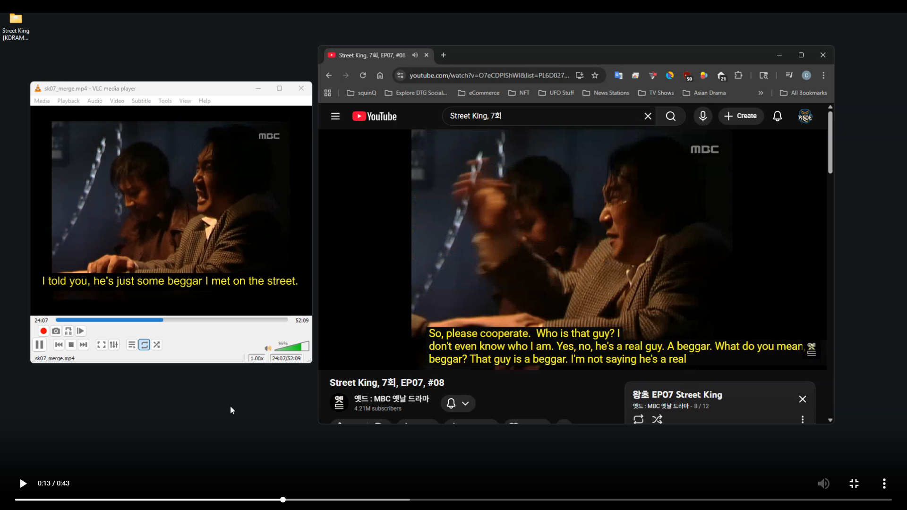
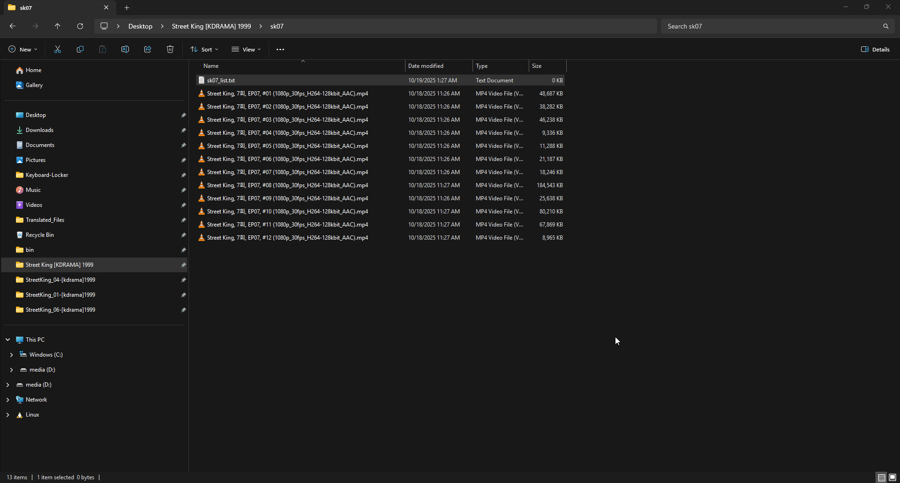

# The Boss 왕초 ‧ KDrama ‧ 1999 [English Subtitles] (MBC)  

<div align="center">
Example of how bad YouTube's `auto transcribe` → `auto translate` feature(s) are. 

[](https://knoeai.github.io/English-Subtitles-The-Boss-KDrama-1999/subs.html)  

<span style="color: green;">Left: my [`knoe.ai`] PTT (Precise Translation Timing) captions</span> &nbsp;&nbsp;&nbsp;   |  &nbsp;&nbsp;&nbsp;  <span style="color: red;">Right: YouTube's "real-time" translated captions</span> 
</div>  

## Guide
Go to YouTube and search for the episode number `Street King, 1회`  
This should also net you the results: https://www.youtube.com/results?search_query=Street+King%2C+1%ED%9A%8C

Look for the `playlist` from MBC for your episode. Below is an example of episode 01:  
```
왕초 EP01 Street King   
옛드 : MBC 옛날 드라마 • Playlist  
Street King, 1회, EP01, #01 · 7:14  
Street King, 1회, EP01, #02 · 4:41  
View full playlist  
```
Download the episodes from the playlist  
( There are many free tools to do this | For Windows GUI users try `JDownloader 2`. | For command prompt users try `FFMPEG` or `YT-DLP` )  

Rename the files if needed   
Create a text file to list the files for `FFMPEG` ( ie: `sk01.txt` )  
  

Use the `batch_convert.bat` file to convert your video files before doing the merge.  
Edit the `bat` file with a text editor if needed.  
It will find all the video files in a single folder or directory and convert them all to the same bitrate/fps.  

Then use the `FFMPEG` code snippet below to merge the videos, using a text file to list the videos.  

```
ffmpeg -f concat -safe 0 -i "C:\Users\corey\Downloads\streetking01\sk01.txt" -c:v libx264 -preset slow -crf 20 -c:a aac -b:a 128k sk01_merge.mp4
```
This ensures you get a single video file without issues  
Unless you knoe what you are doing and what to look for when processing video/audio channels  
You might have video files that are .mkv and .mp4 format or different bitrates, etc.  
If you try to merge those files without converting them, you could run into a headache  

Once you have a single video file for your episode  
You are now ready to use the subtitle files within this Git repository  

---  

## 🧾 Creative Commons License

Subtitle files in this repository are licensed under the **Creative Commons Attribution‑ShareAlike 4.0 International (CC BY‑SA 4.0)** license.  
You may copy, modify, and redistribute these subtitles under the same license, provided you give appropriate credit.

However, you **may not** use these subtitle files:
- For commercial purposes (e.g., selling or marketing them)
- As part of any video content that is distributed, marketed, or monetized **without permission** from the original video’s creator or current intellectual property holder

These subtitles are intended for **educational, archival, or personal use only**, in alignment with fair use principles.    

## 🕒 PTT: Precise Translation Timing

**PTT (Precise Translation Timing)** is a custom subtitle synchronization method developed for this project. It ensures that subtitles appear **word-for-word** in perfect alignment with spoken dialogue, enhancing clarity, immersion, and accessibility.

Unlike traditional subtitle formats that rely on scene-based timing or sentence-level cues, PTT delivers **granular, real-time captioning** that mirrors the speaker’s rhythm and pacing. This is especially useful for language learners, accessibility tools, and high-precision translation workflows.  

--- 

## Author Notes  
Created this `README` fairly quickly. Will update in more detail if need be later.  

While making subtitles for this TV show, reading old articles about the production and details about this TV series.  
I come to find out that this is a true story.  
  
This TV series is about the life of '거지왕' 김춘삼 Kim Chun-sam, known as the "King of Beggars.  
(https://en.namu.wiki/w/%EA%B9%80%EC%B6%98%EC%82%BC)   

The older I get, the more I enjoy reading about history and non-fictional accounts.  
This was a surprise and made this subtitle project more salient.  

---

## ⚖️ Copyright & Usage

> **PTT (Precise Translation Timing)** is a proprietary method created by `knoe.ai`.  
> All original code, timing logic, and documentation are © 2025 by `knoe.ai`.  
> The PTT workflow and subtitle creation process are **private and copyrighted**.  
> Unauthorized reproduction, reverse-engineering, or commercial use of this system without written permission is strictly prohibited.
  

## 📢 Disclaimer

This project is **not affiliated with MBC**, the original broadcaster of *The Boss (왕초)*, or with any current or past rights holders in South Korea, the United States, or elsewhere.  
To our knowledge, *The Boss (1999)* has not been officially licensed or distributed in the United States.  
The subtitle files and timing tools provided here are intended for **educational, archival, and non-commercial use only**, in accordance with fair use principles.

If any rights holders or representatives wish to contact us regarding this project, we welcome respectful dialogue and will respond promptly.
